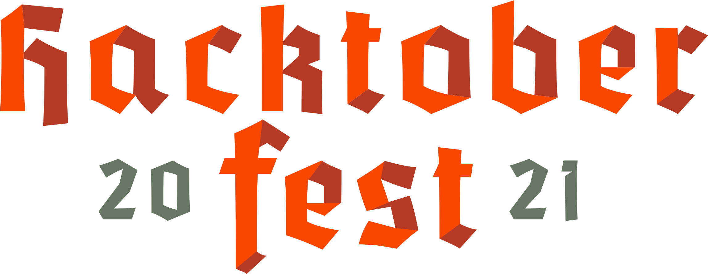

#  Students are Welcome

> This repository is for students only.

---

### How to contribute 

-  Fork this repository.
-  Star this repository.
-  Get an issue assigned.
-  Work on the issue.
-  Commit the code.
-  Make a pull request.

---

## Getting started !

#### How to clone 

```
    git clone https://github.com/YOUR_NAME/Student.git
```
#### Navigate to student directory 

```
    cd Student
```
#### Add your contribution, commit and push 

```
    git add .
    git commit -m "Short description about your contribution"
    git push 
```

---

## References
- [Project's Live Link](http://patelankit.me/)

